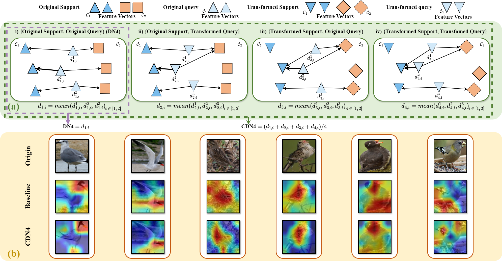
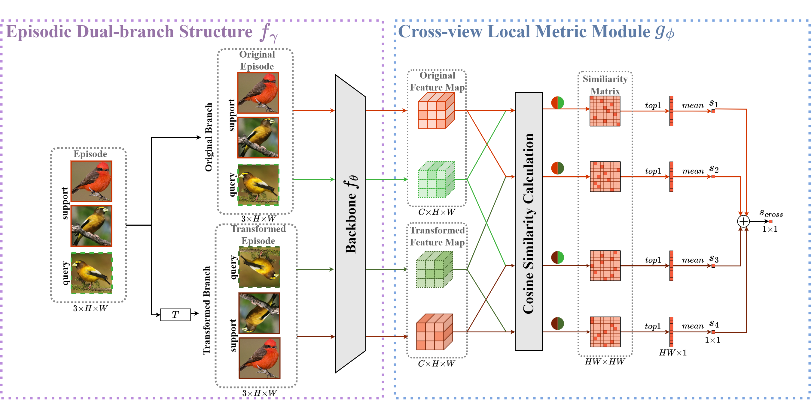

# CDN4: A Cross-View Deep Nearest Neighbor Neural Network for Fine-Grained Few Shot Classification

This repository contains the code release for [CDN4: A cross-view Deep Nearest Neighbor Neural Network for fine-grained few-shot classification - ScienceDirect](https://www.sciencedirect.com/science/article/pii/S0031320325001268). (Accepted in PR)

> **<p align="justify"> Abstract:** *The fine-grained few-shot classification is a challenging task in computer vision, aiming to classify images with subtle and detailed differences given scarce labeled samples. A promising avenue to tackle this challenge is to use spatially local features to densely measure the similarity between query and support samples. Compared with image-level global features, local features contain more low-level information that is rich and transferable across categories. However, methods based on spatially localized features have difficulty distinguishing subtle category differences due to the lack of sample diversity. To address this issue, we propose a novel method called Cross-view Deep Nearest Neighbor Neural Network (CDN4). CDN4 applies a random geometric transformation to augment a different view of support and query samples and subsequently exploits four similarities between the original and transformed views of query local features and those views of support local features. The geometric augmentation increases the diversity between samples of the same class, and the cross-view measurement encourages the model to focus more on discriminative local features for classification through the cross-measurements between the two branches. Extensive experiments validate the superiority of CDN4, which achieves new state-of-the-art results in few-shot classification across various fine-grained benchmarks.* </p>

## Teaser



## Overview



## Code environment

- You can set up a new conda environment by running the following command:
```
conda env create -f environment.yml
conda activate CDN4
```

The following packages are required to run the scripts:

- [PyTorch >= version 1.12.1](https://pytorch.org)

- [tensorboard](https://www.tensorflow.org/tensorboard)


## Dataset 

You should change the "cfg.data.root" parameter in "./configs/miniimagenet_default.py"
The datasets (i.e., CUB, meta-iNat and tiered meta-iNat) can be downloaded from [FRN](https://drive.google.com/drive/folders/1gHt-Ynku6Yc3mz6aKVTppIfNmzML1sNG).

## Train and test

The train/test configurations, TensorBoard logs, and saved checkpoints are organized in the following format:
```
CUB_FSL_CDN4_larger_way_K5_94.583/
├── 2023-11-17-12:00
│   ├── events.out.tfevents.1700222406.amax
│   └── events.out.tfevents.1700222434.amax
├── CUB_FSL_CDN4_larger_way_K5
│   ├── 2023-12-01-08:12
│   │   └── events.out.tfevents.1701418357.amax
│   ├── 2023-12-02-04:47
│   │   └── events.out.tfevents.1701492459.amax
│   ├── CDN4_larger_way_K5.yaml
│   ├── ebest_10way_5shot.pth
│   ├── ebest_10way_5shot.txt
│   └── predictions.txt
├── CDN4_larger_way_K5.yaml
├── ebest_10way_5shot.pth
├── ebest_10way_5shot.txt
└── predictions.txt
```

Download the snapshot files from [Google Drive](https://drive.google.com/drive/u/0/folders/1_YCjI7HvyUFv4d1_MFZTT8eJWVOwmAF_) and extract them into the `snapshots/` directory.

### Meta-training

We manually create the target checkpoint folders and copy (or soft link) the pretrained-model (e.g., `snapshots/ResNet-12/pretrainer/miniImagenet_FRN_pre/miniimagenet-e0_pre.pth`) to it:
```
mkdir ./checkpoint/xxx/
cp ./snapshots/ResNet-12/pretrainer/miniImagenet_FRN_pre/miniimagenet-e0_pre.pth ./checkpoint/xxx/
bash ./fast_train_test.sh ./configs/miniImagenet/ResNet-12/xxx.yaml 0
```
where `xxx` is the prefix of `.yaml` file and `0` indicates the GPU device number.

### Reference

Thanks to [LouieYang](https://github.com/LouieYang/MCL) for the codebase.

### Contact

Thanks for your attention! If you have any suggestions or questions, please feel free to contact me.
- ds1181014496@outlook.com

